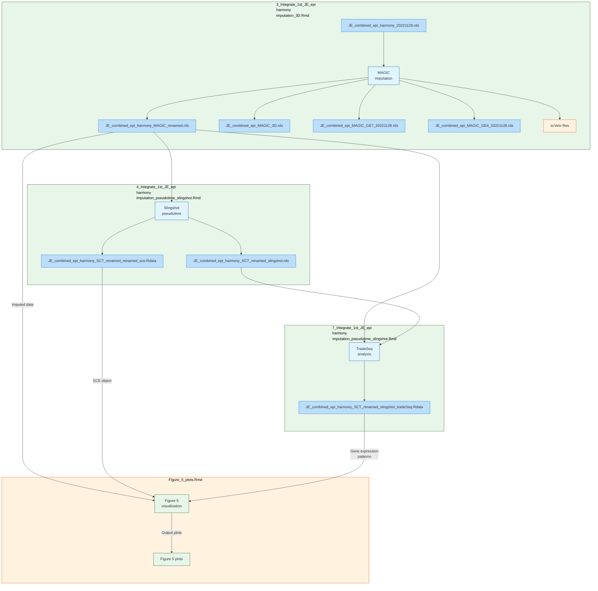

# Single-cell RNA Analysis Data Flow Documentation 

# For Figure 5 scRNA-seq data

# (Arranged by Execution Order)

## 3_Integrate_1st_JE_epi_harmony_imputation_3D.Rmd

### Input Data
- `./SeuratObject/JE_combined_epi_harmony_20221128.rds`

### Output RDS
- `./SeuratObject/JE_combined_epi_harmony_MAGIC_renamed.rds`
- `./SeuratObject/JE_combined_epi_MAGIC_3D.rds`
- `./SeuratObject/JE_combined_epi_MAGIC_GE7_20221128.rds`
- `./SeuratObject/JE_combined_epi_MAGIC_GE4_20221128.rds`
- Files in `./scVeloInput/` directory for RNA velocity analysis

---

## 4_Integrate_1st_JE_epi_harmony_imputation_pseudotime_slingshot.Rmd

### Input Data
- `./SeuratObject/JE_combined_epi_harmony_MAGIC_renamed.rds` (Output from 3_Integrate)

### Output RDS
- `./SeuratObject/JE_combined_epi_harmony_SCT_renamed_slingshot.rds`
- `./SeuratObject/JE_combined_epi_harmony_SCT_renamed_renamed_sce.Rdata`

---

## 7_Integrate_1st_JE_epi_harmony_imputation_pseudotime_slingshot.Rmd

### Input Data
- `./SeuratObject/JE_combined_epi_harmony_MAGIC_renamed.rds` (Output from 3_Integrate)
- `./SeuratObject/JE_combined_epi_harmony_SCT_renamed_slingshot.rds` (Output from 4_Integrate)

### Output RDS
- `./SeuratObject/JE_combined_epi_harmony_SCT_renamed_slingshot_tradeSeq.Rdata`

---

## Figure_5_plots.Rmd

### Input Data
- `./Figure5_scRNA_part/Figure5_scRNA_part.Rdata` (Cache data)
- `./SeuratObject/JE_combined_epi_harmony_SCT_renamed_slingshot_tradeSeq.Rdata` (From 7_Integrate)
- `./SeuratObject/JE_combined_epi_harmony_MAGIC_renamed.rds` (From 3_Integrate)
- `./SeuratObject/JE_combined_epi_harmony_SCT_renamed_renamed_sce.Rdata` (From 4_Integrate)

### Output RDS
- `./Figure5_scRNA_part/Figure5_scRNA_part.Rdata` (Updated cache data)
- Various plot files in `./Figure5_scRNA_part/` directory

---

## Data Flow Diagram
