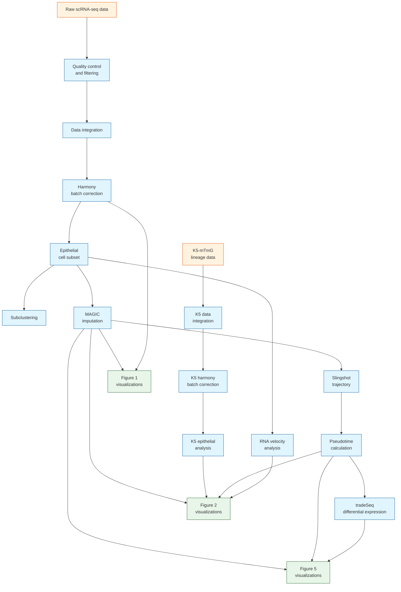

# JE Paper scRNA-seq Analysis and Plot Data Flow

This document summarizes the data flow for single-cell RNA sequencing analysis across Figures 1, 2, and 5 of the JE paper.

## Overview of Analysis Workflow

The scRNA-seq analysis workflow consists of several key steps:
1. Initial data processing and integration
2. Harmony batch correction
3. Epithelial cell subpopulation analysis
4. MAGIC imputation for gene expression smoothing
5. Trajectory and pseudotime analysis using Slingshot
6. Differential gene expression analysis along trajectories using tradeSeq
7. Figure-specific visualizations

## Figure 1: 1st JE scRNA-seq Analysis

### Analysis Scripts
1. **1_Integrate_1st_JE_harmony_celltype_annotation.Rmd**
   - **Input**: Raw Seurat objects (`JE_D0_raw.rds`, `JE_D3_raw.rds`, `JE_D5_raw.rds`)
   - **Output**: Filtered Seurat objects and integrated data (`JE_combined.rds`, `JE_combined_harmony.rds`)
   - **Process**: Quality filtering, data integration, and harmony batch correction

2. **2_Integrate_1st_JE_epi_harmony_subcelltype.Rmd**
   - **Input**: `JE_combined_epi_harmony_20221128.rds`
   - **Output**: Files for RNA velocity analysis in `./scVeloInput/` directory
   - **Process**: Epithelial subpopulation analysis

3. **3_Integrate_1st_JE_epi_harmony_imputation_3D.Rmd**
   - **Input**: `JE_combined_epi_harmony_20221128.rds`
   - **Output**: MAGIC imputed data (`JE_combined_epi_harmony_MAGIC_renamed.rds`, `JE_combined_epi_MAGIC_3D.rds`, etc.)
   - **Process**: MAGIC imputation for gene expression smoothing

4. **Figure_1_plots.Rmd**
   - **Input**: `JE_combined_harmony_20221128.rds`, `JE_combined_epi_harmony_MAGIC_renamed.rds`, `perio_seurat_20221008.rds`
   - **Output**: Figure 1 visualization plots
   - **Process**: Generation of UMAP, feature plots, and other visualizations for Figure 1

## Figure 2: JE scRNA-seq Analysis with K5 Lineage Tracing

### Analysis Scripts
1. **JE_K5mTmG Seurat Object Generation**
   - **Input**: Raw data from K5-mTmG lineage tracing experiment
   - **Output**: Seurat objects (`JE_K5_D0_Seurat.rds`, `JE_K5_D3_Seurat.rds`, `JE_K5_D5_Seurat.rds`)

2. **2_Integrate_1st_JE_epi_harmony_subcelltype.Rmd**
   - **Input**: `JE_combined_epi_raw_20221130.rds`
   - **Output**: Files for RNA velocity analysis
   - **Process**: Subpopulation analysis of epithelial cells

3. **3_Integrate_1st_JE_epi_harmony_imputation_3D.Rmd**
   - **Input**: `JE_combined_epi_harmony_20221128.rds`
   - **Output**: MAGIC imputed data
   - **Process**: MAGIC imputation for gene expression smoothing

4. **4_Integrate_1st_JE_epi_harmony_imputation_pseudotime_slingshot.Rmd**
   - **Input**: MAGIC imputed data
   - **Output**: Slingshot pseudotime analysis results
   - **Process**: Trajectory inference and pseudotime calculation

5. **5_JE_K5_mTmG.Rmd**
   - **Input**: K5 lineage Seurat objects
   - **Output**: Integrated K5 data (`JE_K5_combined.rds`, `JE_K5_combined_harmony.rds`)
   - **Process**: Integration and harmony batch correction of K5 lineage data

6. **6_JE_K5_mTmG_epi.Rmd**
   - **Input**: `JE_K5_combined_harmony.rds`
   - **Output**: `JE_K5_combined_epi_harmony.rds`
   - **Process**: Epithelial-specific analysis of K5 lineage data

7. **Figure_2_plots.Rmd**
   - **Input**: MAGIC data, K5 lineage data, pseudotime data, velocity data
   - **Output**: Figure 2 visualization plots
   - **Process**: Generation of visualizations for Figure 2

## Figure 5: Gene Expression Dynamics Analysis

### Analysis Scripts
1. **3_Integrate_1st_JE_epi_harmony_imputation_3D.Rmd**
   - **Input**: `JE_combined_epi_harmony_20221128.rds`
   - **Output**: MAGIC imputed data and RNA velocity input files
   - **Process**: MAGIC imputation for gene expression smoothing

2. **4_Integrate_1st_JE_epi_harmony_imputation_pseudotime_slingshot.Rmd**
   - **Input**: `JE_combined_epi_harmony_MAGIC_renamed.rds`
   - **Output**: Slingshot objects (`JE_combined_epi_harmony_SCT_renamed_slingshot.rds`, `JE_combined_epi_harmony_SCT_renamed_renamed_sce.Rdata`)
   - **Process**: Trajectory inference and pseudotime calculation

3. **7_Integrate_1st_JE_epi_harmony_imputation_pseudotime_slingshot.Rmd**
   - **Input**: MAGIC imputed data and Slingshot objects
   - **Output**: tradeSeq analysis results (`JE_combined_epi_harmony_SCT_renamed_slingshot_tradeSeq.Rdata`)
   - **Process**: Differential expression analysis along trajectories

4. **Figure_5_plots.Rmd**
   - **Input**: MAGIC data, Slingshot objects, tradeSeq results
   - **Output**: Figure 5 visualization plots
   - **Process**: Generation of visualizations for gene expression dynamics

## Integrated Data Flow Diagram

## Key Shared Resources

Several key data objects are shared across multiple analyses:

1. **`JE_combined_epi_harmony_20221128.rds`**: Core integrated epithelial dataset used in all figures
2. **`JE_combined_epi_harmony_MAGIC_renamed.rds`**: MAGIC-imputed data used for trajectory analysis and visualization
3. **Slingshot objects**: Used for pseudotime analysis in Figures 2 and 5
4. **K5 lineage data**: Specifically used for Figure 2 to track epithelial lineages

## Analysis Tools and Methods

1. **Seurat**: Core package for scRNA-seq data processing and visualization
2. **Harmony**: Used for batch correction across samples
3. **MAGIC**: Used for gene expression imputation to improve visualization
4. **Slingshot**: Used for trajectory inference and pseudotime calculation
5. **tradeSeq**: Used for differential expression analysis along trajectories
6. **RNA velocity**: Used to infer cellular dynamics and directionality

## Figure-Specific Analyses

1. **Figure 1**: Focus on overall cell type identification and basic characterization
2. **Figure 2**: Focus on K5 lineage tracing and epithelial cell fate dynamics
3. **Figure 5**: Focus on gene expression dynamics along developmental trajectories

This document provides a high-level overview of the data flow for scRNA-seq analysis in the JE paper. For detailed methods and parameters, please refer to the individual analysis scripts. 